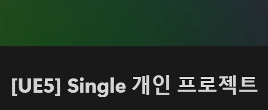
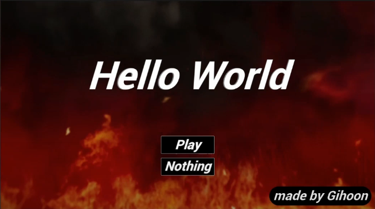

# $\large\bf\color{#556B2F}Unreal\ Engine5\ Project$

### $\large\bf\color{#CD5C5C}프로젝트\ 명$
Hello World

### $\large\bf\color{#CD5C5C}프로젝트\ 인원$
1명 (김기훈)

### $\large\bf\color{#CD5C5C}프로젝트\ 기간$
2024/08/24 ~ 2023/09/03

### $\large\bf\color{#CD5C5C}목적$
① Unreal Engine5 의 활용법 학습 
② 게임 엔진의 구조와 흐름에 대한 이해 
③ Unreal Blueprint 와 Unreal C++ 의 활용 능력의 향상 
④ 기능 구현 및 응용 능력 향상 

### $\large\bf\color{#CD5C5C}진행 계획$
1주차 : 플레이어 제작
 
2주차 : 일반/에픽 몬스터 제작
 
3주차 : 레벨디자인,사운드,파티클 추가 및 마무리

### $\large\bf\color{#CD5C5C}Notion\ URL$

 

### $\large\bf\color{#CD5C5C}Youtube\ URL$

 

### $\large\bf\color{#CD5C5C}타임라인$
<b>24/08/24 :</b> 
[프로젝트 시작] 
-&nbsp;프로젝트 생성 
-&nbsp;플레이어 캐릭터 생성 
-&nbsp;플레이어 입력값 받아오기(Enhanced Input) 

<b>24/08/25 :</b> 
-&nbsp;플레이어 이동구현 
-&nbsp;플레이어 애니메이션(Idle,Walk/Run)추가 
-&nbsp;캐릭터 스탯 컴포넌트 제작 

<b>24/08/26 :</b> 
-&nbsp;아이템 구현 

<b>24/08/27 :</b> 
-&nbsp;플레이어와 아이템 상호작용 

<b>24/08/28 ~ 08/30:</b> 
-&nbsp;인벤토리 구현 
-&nbsp;장비장착 구현 

<b>24/08/30 :</b> 
-&nbsp;플레이어 일반 공격 애니메이션 
-&nbsp;플레이어 일반 공격 타격판정 
-&nbsp;Child Actor Component 추가 

<b>24/08/31 :</b> 
-&nbsp;몬스터 애셋(애니메이션,매쉬) 수급 
-&nbsp;Team 설정 
-&nbsp;Normal Monster AI 로직작성(Behavior Tree) 
-&nbsp;Monster UI (HUD) 

<b>24/09/01 :</b> 
-&nbsp;플레이어 일반 공격 타격판정 보완 
-&nbsp;플레이어 Run/Roll 로직구현 
-&nbsp;Main, Stage Level 제작 

<b>24/09/02 :</b> 
-&nbsp;Trigger 제작 
-&nbsp;몬스터 감각기간 추가(Sight Perception) 
-&nbsp;Epic Monster 제작 

<b>24/09/03 :</b> 
-&nbsp;플레이어 콤보공격 구현 
[프로젝트 마무리 및 발표] 